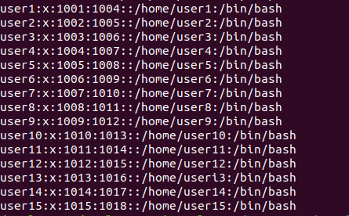
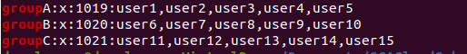
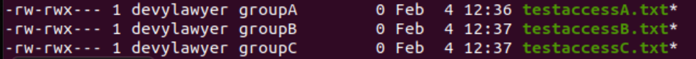
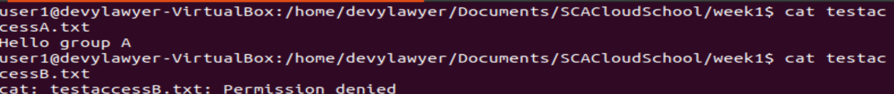
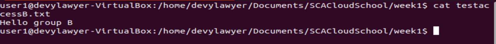

[](https://dev.azure.com/devylawyer/3db72a94-2802-4ab6-80ee-da1adfdaf803/_boards/board/t/c1c32732-e42a-4552-87f5-77cd77dd552a/Microsoft.RequirementCategory)
# Week 1 Tasks

Week 1 task is to demonstrate the understanding of the DevOps concepts, users, groups and permissions in Linux

## Task 1 - Create 15 users and 3 groups
### Crate 15 users

To create a single user in Linux, you can use the command ```sudo adduser <user>```. 

In this scenario, we are creating multiple users and this can be achieved using the ```newusers <file>``` command which creates and updates new users in batch.

The file will contain the names of the users and their passwords which are required. Other parameters include  uid (user ID), gid (primary group ID), gecos (GECOS field), dir (home directory of the user), shell (shell of the user).

Run ```touch users.txt``` to create a new file. The file will contain the required parameters in this format
**pw_name:pw_passwd:pw_uid:pw_gid:pw_gecos:pw_dir:pw_shell**

Run ```sudo newusers users.txt``` to create 15 users at once.
To verify that the users have been created, run ```sudo cat /etc/passwd```.


### Create 3 groups
Run this command to create a group ```groupadd <group name>```
To verify that the group has been created, we use the grep command like this ```grep <groupname> /etc/group```. This will find the group.
Run this command to get all the existing groups ```getent group```.


### Assign the users across the 3 created groups.

Run this command ```usermod -G groupname username``` to add a user to a group.
To do this, I will use a simple forloop because I do not want to assign the groups individually. The beauty of the command line interface is the ability to execute a command against multiple users/groups at once.

I will use the command below to add users (1-5)  to group A, users (6 -10) to group B and users (11 -15) to group C.
```for i in user1 user2 user3 user4 user5; do usermod -G groupA $i; done```
```for i in user6 user7 user8 user9 user10; do usermod -G groupA $i; done```
```for i in user11 user12 user13 user14 user15; do usermod -G groupA $i; done```
* This command has to be run as a root user.

We can use this command ```grep <groupname> /etc/group`` to verify that the users have been added to their respective groups. The members of the group will appear after the group name as below.



### Demonstrate that user(s) in a group cannot access files/folders that belong to another group unless they are added to that group

In Linux, each file or folder has 3 permissions divided into user, group and others. Each of these people can have the right to read, write and execute a file or folder. For example, **groupA** will own the file **testaccessA.txt** file. We need to have administrator permission to do this.
The command is *** sudo chgrp [OPTIONS]  GROUPNAME FILE(s)***
I created 3 files with the text "Hello Group" and made each group the owner of each file.
```sudo chgrp groupA testaccessA.txt```
```sudo chgrp groupB testaccessB.txt```
```sudo chgrp groupC testaccessC.txt```

This command does not return an output. To verify that it was successful, I will run this command ```ll``` and the output is below.



Now, we will check if users in groupA can access the file testaccessB.txt. In Linux, we can login as another user by running the ```sudo su user1 command```

When we try to read or write to testaccessA.txt, userI is able to do so successfully. However, he is not able to read what is in testaccessB.txt.

 


Now, we will add user1 to groupB and confirm if he is able to read testaccess.txt file using the command below
```sudo usermod -aG groupB user1```

Now, when user1 is logged in, he is able to read and write to testaccessB.txt file.


